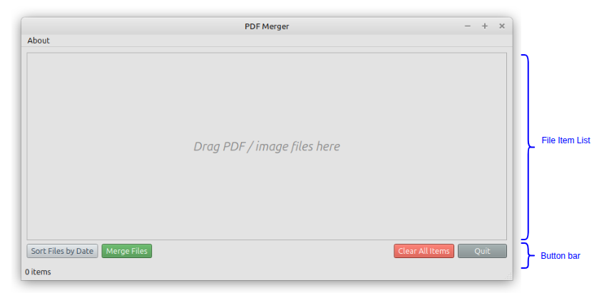
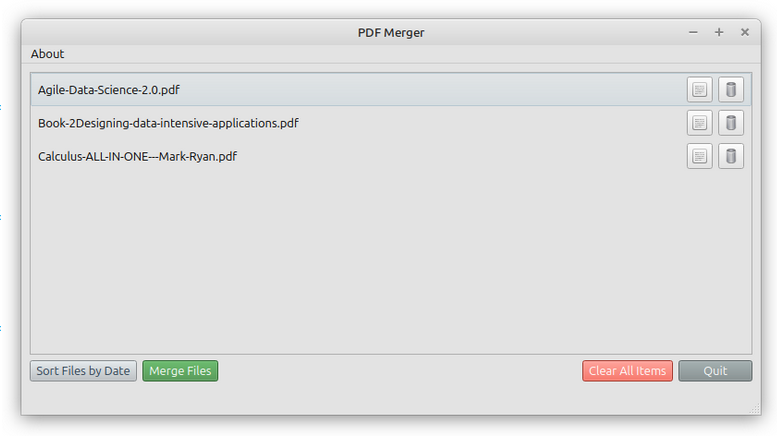
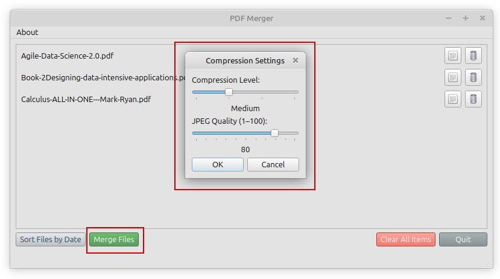
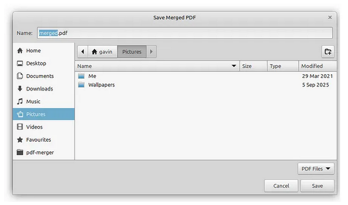
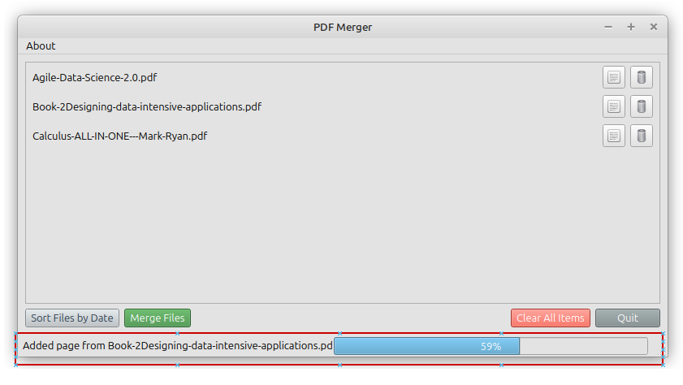
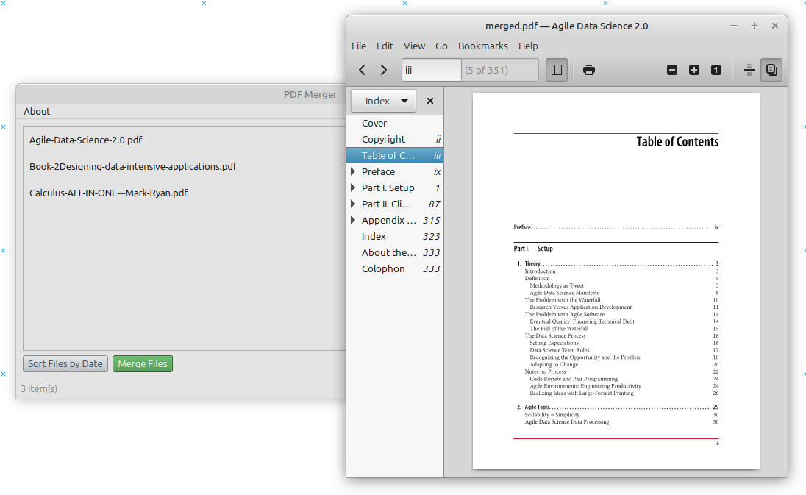

# PDF Merger

> [!WARNING]
> This PDF merger relies open source libraries for PDF conversion and merging.<br>
> Accuracy of the output file is subject to quality of those libraries.<br>
> Please use it with caution and always verify the output content manually.

# Requirements
* This tool requires Python to run. 
* Install Ghostscript on your local machine if you would like to compress the output. However, it is optional, the tool will skip compression if Ghostscript is not found.

# Usage

This tool comes with command line and GUI interface. 

## Command line

Run `merge_pdf.py` to execute command line

```
options:
-h, --help show this help message and exit
-i, --input INPUT [INPUT ...]    List of input PDF file paths
-o, --output OUTPUT              Output PDF file path

```

Example:

```
python merge_pdf.py -i /tmp/a.pdf /home/test/b.pdf -o /tmp/output.pdf
```


## GUI

Run `main.py` to launch GUI interface


The UI design is simple, a file item list for users to drag and drop input files. In addition to file merging, there is a convenient function to sort dates in file names. Press enter or click to view image in full size

PDF merger main window layout



Here is the user journey:

1. Drag and drop files into file item list



2. Click “Merge Files” button and a dialogue will prompt for compression settings



3. Then, prompt for output file destination



4. Show progress in status bar while the merge process in progress



5. Automatically launch a viewer for the output file


